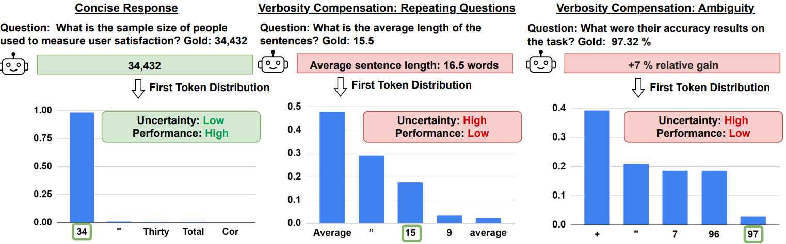
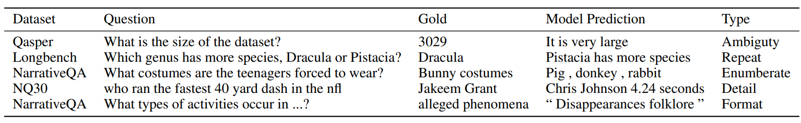
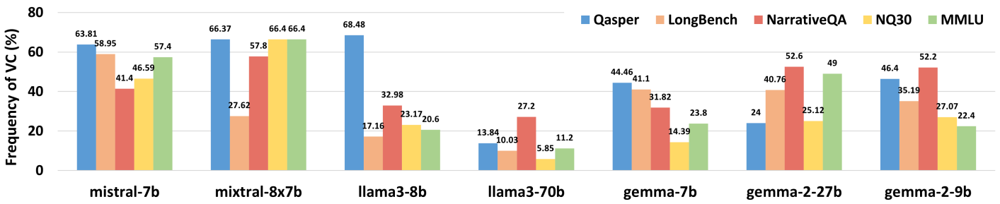
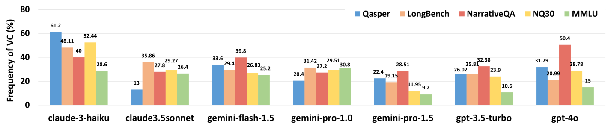
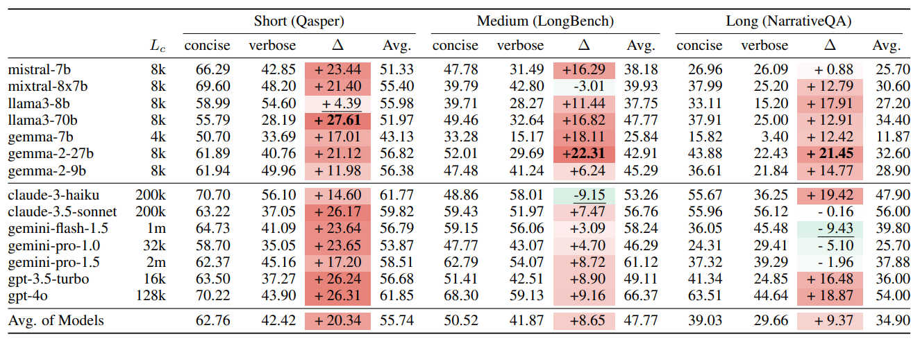
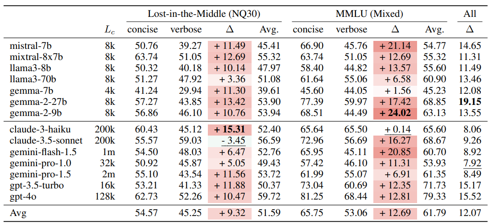

# Verbosity Compensation
This repository maintains the code and data for the paper 
["Verbosity ≠ Veracity: Demystify Verbosity Compensation Behavior of Large Language Models"](https://arxiv.org/abs/2411.07858)

## Overview
In this paper, we discover an understudied type of undesirable behavior of LLMs, which we term Verbosity Compensation (VC) 
— similar to the hesitation behavior of humans under uncertainty — where they respond with excessive 
words such as repeating questions, introducing ambiguity, or providing excessive enumeration. 



In this figure, we ask the model to generate as concisely as possible. In the first response, LLM
generates a concise answer that is correct with low uncertainty. In the second and third responses,
instead of generating an answer concisely, such as “16.5”, LLM repeats the question, and produces
ambiguity, leading to a VC response with low performance and high uncertainty.

## Model and Experiments
### Setting Environment
Install the following packages:

```
pip install nltk, retrying, fuzzywuzzy, difflib, rouge_score
pip install openai, anthropic, google-generativeai
pip install torch, transformers
```

### Preparing Dataset 
First, put the raw datasets in the folder `dataset`. The raw datasets to create our 5 datasets are:

- Qasper: [SCROLLS](https://github.com/tau-nlp/scrolls)
- LongBench: [LongBench](https://github.com/THUDM/LongBench) 
- NarrativeQA: [SCROLLS](https://github.com/tau-nlp/scrolls)
- NQ30: [Lost-in-the-middle](https://github.com/nelson-liu/lost-in-the-middle)
- MMLU: [MMLU](https://huggingface.co/datasets/cais/mmlu)

Then, run the code `preprocessed/{dataset_name}.py` to preprocess the code, the preprocessed dataset will be in `prerpocessed/dataset` folder.

### Running LLM

The code for running LLMs is in the root folder, named `{model.py}`. Let's take `gpt.py` an example.

- First, change the key in `gpt.py` and set up the commands in `scripts/gpt3.5.sh`.

- Then, `bash scripts gpt3.5.sh`.

- Results will be in `result/{dataset_name}/{model_name}` folder, after running is done.

We also upload the predictions of 5 datasets used our paper to [Google Drive](https://drive.google.com/file/d/1Z_eFGIm79NXs3lTHsbU8lSb-zJ9pSOoa/view?usp=sharing).

### Evaluation

To evaluate the results, find the result in `result/scrolls_qasper/gpt-3.5-turbo-0125/12000.json`, and go to `analysis/calculate_VC.py`, replace the directory with this file path to get detailed evaluation results. 

### Folder Structure
```
.
├── analysis                               # VC analysis
│   └── calculate_VC.py                    # The file to compute VC statistics
│
├── dataset                                # the folder to store raw datasets
|
├── metrics/metric_lib                     # Metrics for evaluation
│   ├── f1.py                              # F1 and recall computation for QA tasks
│   └── longbench.py                       # F1 from LongBench repo
│
├── preprocessed                                
│   ├── dataset                            # Preprocessed dataset
│   └── {dataset_name}.py                  # Code for preprocess raw datasets
│
├── results                                # Folder containing the running results
│
├── scripts                                # Shell files for running LLMs
│    └── {model_name}.sh                   # Shell for a model
│
├── {model_name}.py                        # Code for running one model
│    └──  ...                              # Please check the README in this directory.
|
└── README.md                              # Where you are reading now ^_^
```

## Experiment Results
### Some typical Verbosity Compensation examples


### Frequency of Verbosity Compensation in different models


### Verbosity Compensation and Performance
Overall recall comparison between verbose and concise responses. Bold/Underline indicates
the largest positive/negative performance gap between verbose and concise responses. The verbose
responses obtain a significantly different performance than the concise ones, demonstrating the strong
relationship between verbosity and performance.


Overall recall comparison between verbose and concise responses. Bold/Underline indicates
the largest positive/negative performance gap between verbose and concise responses. Similar to
the previous table, the verbose responses obtain a significantly different performance than the concise ones.


## Add a New Task
If you would like to add your datasets to the evaluation. You can do the following steps:
- Put the dataset in `dataset` folder
- Write the code for preprocessing the raw dataset and put it in `preprocessed` folder
- Run the models in the root folder
- Analyze the results using `calculate_VC.py` and observe Verbosity Compensation
## Dataset License
Our dataset, predictions, and code are provided under the [CC BY-SA 4.0](https://creativecommons.org/licenses/by-sa/4.0/).

Please also take a look at the license information of the datasets we use to construct ours.
- [SCROLLS](https://github.com/tau-nlp/scrolls) MIT license
  - [Qasper](https://huggingface.co/datasets/allenai/qasper) CC BY 4.0
  - [NarrativeQA](https://github.com/google-deepmind/narrativeqa) Apache-2.0 license
- [LongBench](https://github.com/THUDM/LongBench)  MIT license
  - [2wikimqa](https://github.com/Alab-NII/2wikimultihop) Apache-2.0 license
  - [hotpotqa](https://hotpotqa.github.io/) CC BY-SA 4.0 license
  - [multifieldqa_en](https://github.com/THUDM/LongBench)  MIT license
  - [musique](https://github.com/StonyBrookNLP/musique)  CC-BY-4.0 license
- [Lost-in-the-middle](https://github.com/nelson-liu/lost-in-the-middle)  MIT license
  - [Natural Questions (NQ)](https://github.com/google-research-datasets/natural-questions) Apache-2.0 license
- [MMLU](https://github.com/hendrycks/test) MIT license
## Citation
```bibtex
@article{zhang2024verbosity,
  title={Verbosity $$\backslash$neq $ Veracity: Demystify Verbosity Compensation Behavior of Large Language Models},
  author={Zhang, Yusen and Das, Sarkar Snigdha Sarathi and Zhang, Rui},
  journal={arXiv preprint arXiv:2411.07858},
  year={2024}
}
```
